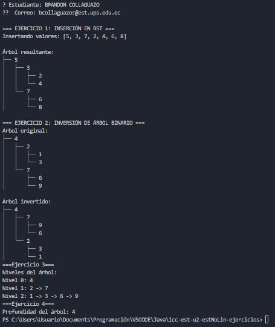

# Práctica Ejercicios Logica con Árboles
## 📌 Información General
- **Título:** Ejercicios Logica con Árboles
- **Asignatura:** Estructura de Datos
- **Carrera:** Computación
- **Estudiante:** Brandon Collaguazo
- **Fecha:** 06/07/2025
- **Profesor:** Ing. Pablo Torres

---

## 🛠️ Descripción
Este proyecto contiene la solución a cuatro ejercicios prácticos sobre estructuras de datos tipo árbol binario, como parte del aprendizaje de estructuras no lineales en Java. Cada ejercicio se encuentra organizado en su propia carpeta, siguiendo la convención de paquetes y buenas prácticas.

---

## 💡 Características
- Lenguaje: Java
- Estructura Modular: Cada ejercicio está organizado en su propia carpeta, facilitando la navegación y el mantenimiento del código.
- Validación de Autoría: Se requiere que los estudiantes completen su nombre y correo institucional en un archivo específico para validar la autoría del trabajo.
- Casos de Prueba: Cada ejercicio incluye casos de prueba para asegurar el correcto funcionamiento de las implementaciones.
- Documentación: Se proporciona un README detallado que explica cada ejercicio, su funcionamiento y cómo ejecutar el proyecto.

---

## 🚀 Resultados

